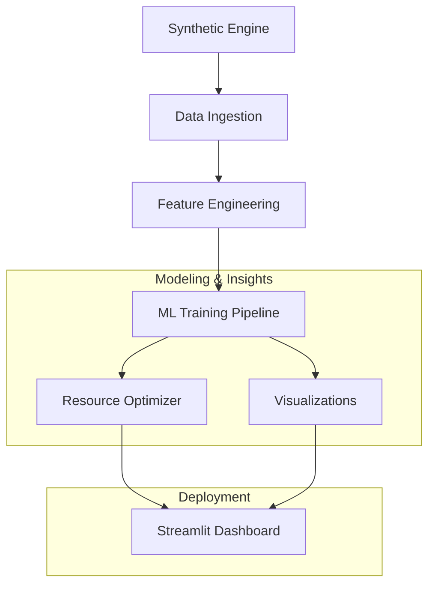
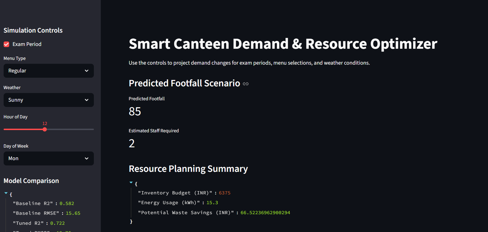
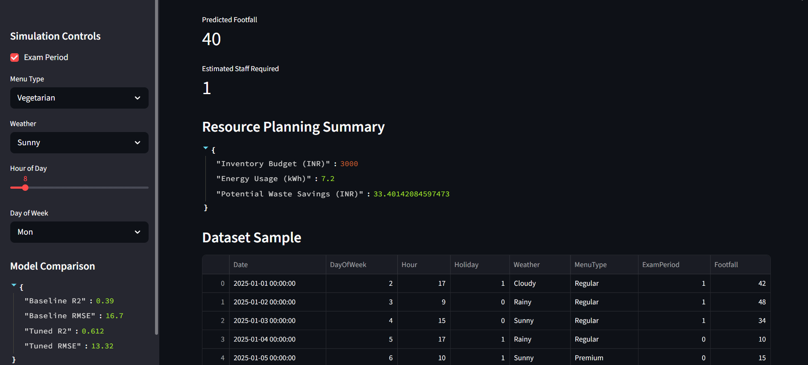

# Smart-Canteen Predictive Demand & Resource Optimizer

A professional-grade machine learning repository built to demonstrate production-ready ML engineering for canteen demand forecasting. This project generates a realistic synthetic dataset, applies feature engineering and model tuning, and serves predictions through an interactive Streamlit dashboard.

## Resume-Ready Project Summary

- Designed and implemented an end-to-end ML solution for demand forecasting and resource optimization.
- Built a synthetic data engine with 500+ realistic records, modeling holiday, weather, menu, and exam period effects.
- Developed a modular Scikit-Learn pipeline with feature scaling, baseline comparison, and GridSearchCV hyperparameter tuning.
- Delivered business-facing outputs: staffing plans, inventory budgets, energy estimates, and INR-based waste savings.
- Packaged the solution with a Streamlit dashboard for scenario simulation and stakeholder-facing visualization.

## Why We Built This

Campus canteens often struggle with demand uncertainty, which leads to overstaffing, excess inventory, and food waste. Existing forecasting approaches are usually too simplistic or lack business-facing optimization logic. This repository was built to show how modern ML engineering can solve these issues with:

- a reproducible synthetic data engine for a realistic demand signal
- a modular pipeline architecture for maintainability
- transparent model comparison and tuning
- business rules that convert predictions into actionable resource plans

## Problems and How This Project Solves Them

### Shortcomings in typical canteen demand systems

- Poor handling of holiday and weather impacts
- Limited feature engineering for cyclical demand patterns
- No clear connection between footfall forecasts and staffing or inventory
- Weak model validation and no hyperparameter optimization

### Solution in this repository

- Synthetic data generation includes `Holiday`, `Weather`, `MenuType`, and `ExamPeriod`
- Feature engineering builds cyclical time features and one-hot encodings
- A Scikit-Learn `Pipeline` ensures scaling and model training are consistent
- `GridSearchCV` compares baseline and tuned Decision Tree models with R² and RMSE
- Resource optimization converts predicted footfall into staffing, inventory, energy, and waste savings

## Architecture



## Architecture Overview

- **Synthetic Engine**: Generates a 500+ record dataset with holiday, weather, menu type, and exam period factors.
- **Data Ingestion**: Organizes raw simulation data into a clean DataFrame with realistic noise patterns.
- **Feature Engineering**: Encodes categorical variables, builds cyclical time features, and prepares model-ready inputs.
- **ML Training Pipeline**: Uses a Scikit-Learn pipeline with scaling, a Decision Tree regressor, and `GridSearchCV` hyperparameter tuning.
- **Resource Optimizer**: Converts footfall predictions into operational outputs: staffing, inventory budget, energy usage, and INR waste savings.
- **Visualizations**: Creates insights with heatmaps and residual plots to validate predictions and reveal demand patterns.
- **Streamlit Dashboard**: Provides a business-facing UI for scenario simulation and real-time decision-making.

## Demo Screenshots





## Project Structure

- `src/data_ingestion.py` — Synthetic dataset class with realistic noise, holiday impact, weather effects, and exam period signals.
- `src/feature_engineering.py` — Builds model-ready features and encodes categorical variables.
- `src/model_pipeline.py` — Scikit-Learn pipeline with `StandardScaler`, `DecisionTreeRegressor`, baseline comparison, and `GridSearchCV` tuning.
- `src/resource_optimizer.py` — Converts demand forecasts into staffing, inventory, energy, and INR-based waste savings.
- `src/app.py` — Interactive Streamlit app for scenario simulation and business decision support.
- `src/visuals.py` — Seaborn visualizations including a heatmap and residual plot.

## How to Run

1. Clone or open this repository.
2. Install dependencies:

```bash
pip install -r requirements.txt
```

3. Launch the dashboard:

```bash
streamlit run src/app.py
```

4. Open the provided local URL in your browser.
5. Use the sidebar controls to toggle:
   - `Exam Period`
   - `Menu Type`
   - `Weather`
   - `Hour of Day`

6. Review the predicted footfall, staffing plan, and INR-based inventory/waste metrics.

## What to Expect

- A trained baseline and tuned Decision Tree comparison
- Real-time resource plan output for predicted footfall
- A production-minded code structure with logging and error handling
- A synthetic dataset that demonstrates how demand reacts to weekly cycles, holidays, weather, and exam season

## Career Impact

Use this project to showcase:

- end-to-end ML product development from data ingestion to dashboard deployment
- experience with model validation, hyperparameter tuning, and metric-driven selection
- ability to translate forecasting outputs into operational decisions and financial impact
- practical knowledge of Python, Scikit-Learn, Streamlit, and synthetic data engineering

## Notes

- Staffing is computed as `S = ceil(P / 50)`.
- Inventory budget is estimated in INR using an average plate cost.
- Waste savings are estimated from a 10% reduction in forecast error.
